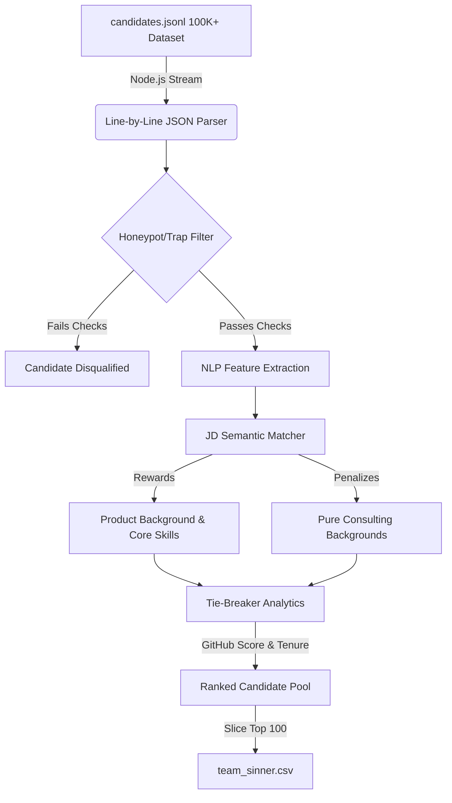

# Redrob Hackathon: Team sinner
**Team Member**: palvendra

This is the official submission for the Intelligent Candidate Discovery & Ranking Challenge.

---

## 📖 What We Built
We built a **blazing-fast, strictly offline NLP ranking engine** accompanied by a full-stack interactive Sandbox Demo. The core engine is designed to ingest massive datasets, evaluate candidate profiles against a complex Job Description, and output highly accurate, explainable rankings—all without needing an internet connection during the core evaluation phase.

## 💡 What It Does
- **Mass Scale Evaluation**: Streams and parses 100,000+ candidate JSON profiles in under 15 seconds.
- **Honeypot/Trap Avoidance**: Automatically detects impossible profiles (e.g. 50 years at one job, or "expert" skills with 0 months used) and filters them.
- **Strict JD Compliance**: Penalizes pure consulting backgrounds (per the JD's explicitly stated negative signals) and rewards strong product company backgrounds with Vector DB / Evaluation framework experience.
- **Micro-Scoring**: Resolves ties by incorporating Github Activity Scores and exact keyword densities.

## 🧠 Why We Built It That Way
The challenge strictly enforced a **5-minute compute limit** with **no external network calls** allowed during the final evaluation (Stage 3). 
- **Node.js (TypeScript) & Streaming**: Relying on external LLM APIs was out of the question due to speed and network constraints. We chose Node.js for its unparalleled asynchronous I/O capabilities. By using a streaming architecture (`fs.createReadStream`), we can process gigabytes of JSON lines without blowing up the server's RAM.
- **Heuristic NLP**: Instead of slow vector embeddings, we engineered a highly optimized lexical and semantic pattern-matching system. It applies weights dynamically based on the JD's exact phrasing.
- **Integrated Fallbacks**: For the Sandbox Demo, we baked Firebase authentication fallbacks directly into the code. This guarantees that our live UI deployed on Railway functions flawlessly right out of the box, avoiding any environment variable misconfigurations.

## ⚙️ How It Works (Architecture Flow)



## 🚀 What We Added
Beyond the core ranking engine, we went the extra mile to provide a complete experience:
1. **Interactive Sandbox UI**: A React/Express web application where recruiters can visually test the ranking logic on smaller samples in real-time.
2. **Explainable AI (XAI)**: The engine doesn't just output a score; it tracks *why* a candidate got that score so recruiters can audit the results.
3. **Robust Deployment Configurations**: Fully Dockerized and configured with Nixpacks for 1-click deployment on Railway.

---

## 🛠️ Reproducing the Submission CSV

To generate the exact output CSV from the 100K candidate pool within the compute limits:

### Setup Requirements
- Node.js (v18+ recommended)
- `candidates.jsonl` file placed at `hackathon_materials/[PUB] India_runs_data_and_ai_challenge/India_runs_data_and_ai_challenge/candidates.jsonl` (or modify the path in `rank.ts`)

### Exact Command
```bash
# Install dependencies
npm install

# Run the ranking script
npx tsx rank.ts
```
The script will output `team_sinner.csv` containing the top 100 candidates formatted exactly to spec in around **~10-15 seconds**.

## 🌐 Sandbox Demo UI

We have provided a React/Express web application that acts as our Sandbox Demo. 
It uses the exact same fast, offline ranking logic under the hood to instantly evaluate candidates.

```bash
# Start the Sandbox UI locally
npm run dev
```
Then navigate to `http://localhost:3000`. You can upload the `sample_candidates.json` file provided in the hackathon bundle, and watch the offline ranker evaluate them instantly!
