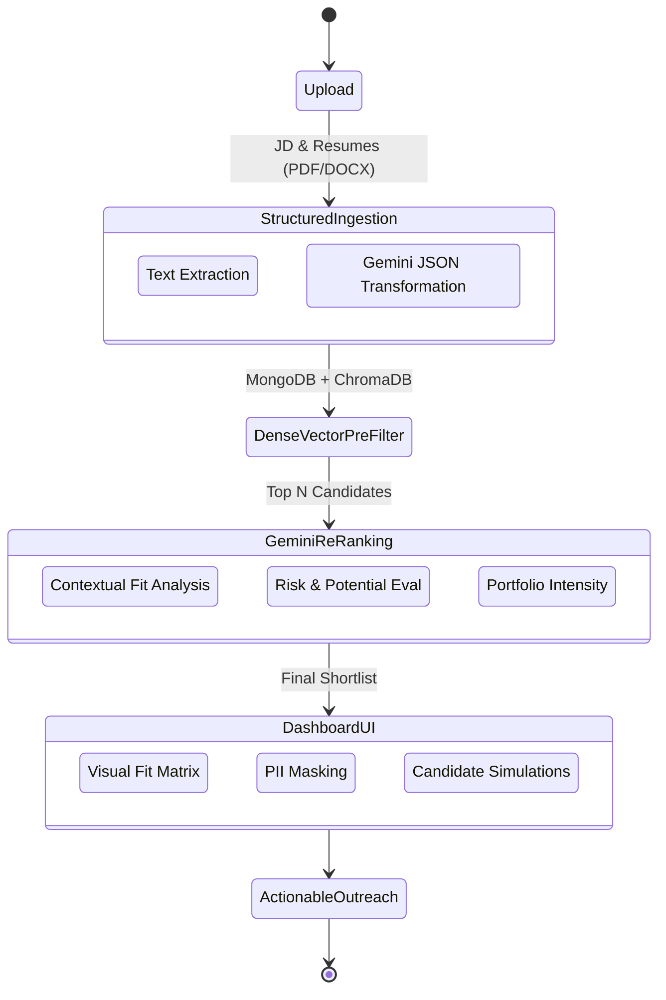

# Smart Recruiter: Contextual AI Talent Engine

A next-generation Talent Intelligence Platform that moves beyond rigid ATS keyword matching. Powered by Google AI Studio (Gemini 2.0) and advanced semantic reasoning, it evaluates candidates based on context, complexity, and true potential.

## Core Features

- **Semantic Intelligence**: Uses deep reasoning to understand project complexity, not just keyword presence.
- **Blind Hiring Mode**: Eradicates unconscious bias by masking PII (names, emails, gender indicators).
- **Dynamic Skill Weighting**: Adjust the importance of Technical Rigor, Leadership, Domain Familiarity, and Soft Skills on the fly.
- **Explainable AI (XAI)**: Provides clear arguments for "Why they excel" and "Identified Gaps".
- **AI Interview Blueprint**: Generates custom interview questions based on each candidate's specific profile gaps.
- **Automated Outreach**: Drafts highly personalized outreach emails referencing candidate projects and JD alignment.
- **Hidden Gem Finder**: Cross-matches candidates against adjacent roles to find talent that might otherwise be discarded.

## Architecture & Lifecycle Flow

## Running the Project

This is a modern React SPA using Vite, Tailwind CSS, and Recharts.

1. `npm install`
2. `npm run dev`

---

## LinkedIn Launch Post Draft

🚀 **Excited to unveil my submission for the India runs on Data & AI Challenge!** 🇮🇳

We all know the pain of traditional ATS systems: rigid keyword filters, high false negatives, and systemic bias. That’s why I built a **Contextual AI Talent Engine** powered by Gemini 2.0.

Instead of parsing for exact keywords, this engine actually *understands* the complexity of a candidate's projects, their leadership trajectory, and their true potential fit for a role. 

✨ **Key Features:**
- **Blind Hiring Mode** to eradicate unconscious bias.
- **Explainable AI** that tells you *why* a candidate fits and what their gaps are.
- **Dynamic Skill Weighting** to prioritize what matters most to your team today.
- **Automated Interview Blueprints** tailored to the candidate’s specific risks.

The future of hiring is context, not regex. Check out the demo and let me know your thoughts! 👇

#GoogleAI #Gemini #FutureOfWork #AI #TalentAcquisition #DataAndAIChallenge
